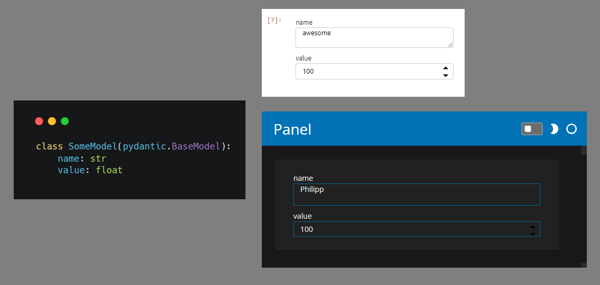
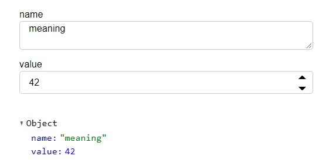

==============
pydantic-panel
==============

**pydantic-panel makes it easy to auto-generate UI elements from
Pydantic models.**

.. image:: https://img.shields.io/pypi/v/pydantic_panel.svg
        :target: https://pypi.python.org/pypi/pydantic_panel
        :alt: Pypi package version

.. image:: https://img.shields.io/badge/Python-3.7%2B-blue&style=flat
        :target: https://pypi.org/project/streamlit-pydantic/
        :alt: Python version

.. image:: https://img.shields.io/travis/jmosbacher/pydantic_panel.svg
        :target: https://travis-ci.com/jmosbacher/pydantic_panel
        :alt: Build Status

.. image:: https://readthedocs.org/projects/pydantic-panel/badge/?version=latest
        :target: https://pydantic-panel.readthedocs.io/en/latest/?badge=latest
        :alt: Documentation Status

.. image:: https://img.shields.io/badge/License-MIT-green.svg
        :target: https://github.com/jmosbacher/pydantic-panel/blob/master/LICENSE
        :alt: MIT License

`Getting Started`_ | `Documentation`_ | `Support`_

pydantic-panel makes it easy to **auto-generate UI elements** from
`Pydantic`_ models and any other Python object. The UI elements
can be used in your **Jupyter Notebook** and in your `Panel`_ **data app**.

This project is at an early stage and potentially contains bugs. You might also
see api changes, USE AT YOUR OWN RISK.

I will continue to add support for more types as I need them. Feel free to 
open issues with feature requests or better yet PRs with implementations.

Getting Started
---------------

Step 1 - Install 

*Requirements: Python 3.7+.*

.. code-block::

    pip install pydantic-panel

Step 2 - Import pydantic_panel and add your models to layouts!

.. code-block:: python
    
    import pydantic

    class SomeModel(pydantic.BaseModel):
        name: str
        value: float

    model = SomeModel(name="meaning", value=42)
    
    import panel as pn
    import pydantic_panel
    pn.extension()

    widget = pn.panel(model)

    layout = pn.Column(widget, widget.json)
    layout.servable()   

Now you can edit your model:

How it works
------------

If you import `pydantic_panel`, it will register the widget automatically using the `panel.BasePane.applies` interface.
After importing, calling `panel.panel(model)` will return a `panel.CompositeWidget` whos value is the model.

When you change one of the sub-widget values, the new value is validated/coerced using the corresponding pydantic
field and if it passes validation/coercion the new value is set on the model itself.
By default this is a one-way sync, if the model field values are changed via code, it does not sync the widgets.

If you want biderectional sync, you can pass `bidirectional = True` to the widget constructor, this will patch the model 
to sync changes to the widgets but this may break without warning if pydantic change the internals of 
their `__setattr__` method.

Customizing Behavior
--------------------

You can add or change the widgets used for a given type by hooking into the dispatch
mechanism (we use plum-dispatch). This can be used to override the widget used for a supported
type or to add support for a new type.

.. code-block:: python

    from pydantic_panel import infer_widget
    from pydantic import FieldInfo
    from typing import Optional

    # precedence > 0 will ensure this function will be called
    # instead of the default which has precedence = 0
    @infer_widget.dispatch(precedence=1)
    def infer_widget(value: MY_TYPE, field: Optional[FieldInfo = None, **kwargs):
        # extract relavent info from the pydantic field info here.

        # return your favorite widget
        return MY_FAVORITE_WIDGET(value=value, **kwargs)

Supported types
---------------

* int
* float
* str
* list
* tuple
* dict
* datetime.datetime
* BaseModel
* List[BaseModel]
* pandas.Interval
* numpy.ndarray

FAQ
---

Q: Why did you decide to use CompositWidget instead of Pane like Param uses?

A: Nested models. This is a recursive problem, so I was looking for a recursive solution. By using a Widget to
display models, all fields are treated equally. A field of type BaseModel is edited with a widget that has a `.value` 
attribute just like any other field and therefore requires no special treatment. When the parent collects the values of its children 
it just reads the `widget.value` attribute and does not need to check whether the value is nested or not. At every level 
of the recursion the widget only has to care about the fields on its model class and watch only the `.value` attribute of
its children widgets for changes.

Features
--------

* TODO

Support & Feedback
------------------

+---------------------+------------------------------------------------+
| Type                | Channel                                        |
+=====================+================================================+
|  🐛 Bugs            + |BugImage|                                     |
+---------------------+------------------------------------------------+
|  🎁 Features        + |FeatureImage|                                 |
+---------------------+------------------------------------------------+
|  ❓ Questions       + |QuestionImage|                                |
+---------------------+------------------------------------------------+

Credits
-------

This package was created with Cookiecutter_ and the `briggySmalls/cookiecutter-pypackage`_ project template.

.. _Cookiecutter: https://github.com/audreyr/cookiecutter
.. _`briggySmalls/cookiecutter-pypackage`: https://github.com/briggySmalls/cookiecutter-pypackage
.. _Pydantic: https://github.com/samuelcolvin/pydantic/
.. _Panel: https://github.com/holoviz/panel
.. _Getting Started: #getting-started
.. _Documentation: https://pydantic-panel.readthedocs.io
.. _Support: #support--feedback
.. |BugImage| image:: https://img.shields.io/github/issues/jmosbacher/pydantic-panel/bug.svg?label=bug
   :target: https://github.com/jmosbacher/pydantic-panel/issues?utf8=%E2%9C%93&q=is%3Aopen+is%3Aissue+label%3Abug+sort%3Areactions-%2B1-desc+
.. |FeatureImage| image:: https://img.shields.io/github/issues/jmosbacher/pydantic-panel/feature.svg?label=feature%20request
   :target: https://github.com/jmosbacher/pydantic-panel/issues?q=is%3Aopen+is%3Aissue+label%3Afeature+sort%3Areactions-%2B1-desc
.. |QuestionImage| image:: https://img.shields.io/github/issues/jmosbacher/pydantic-panel/support.svg?label=support%20request
   :target: https://github.com/jmosbacher/pydantic-panel/issues?q=is%3Aopen+is%3Aissue+label%3Asupport+sort%3Areactions-%2B1-desc